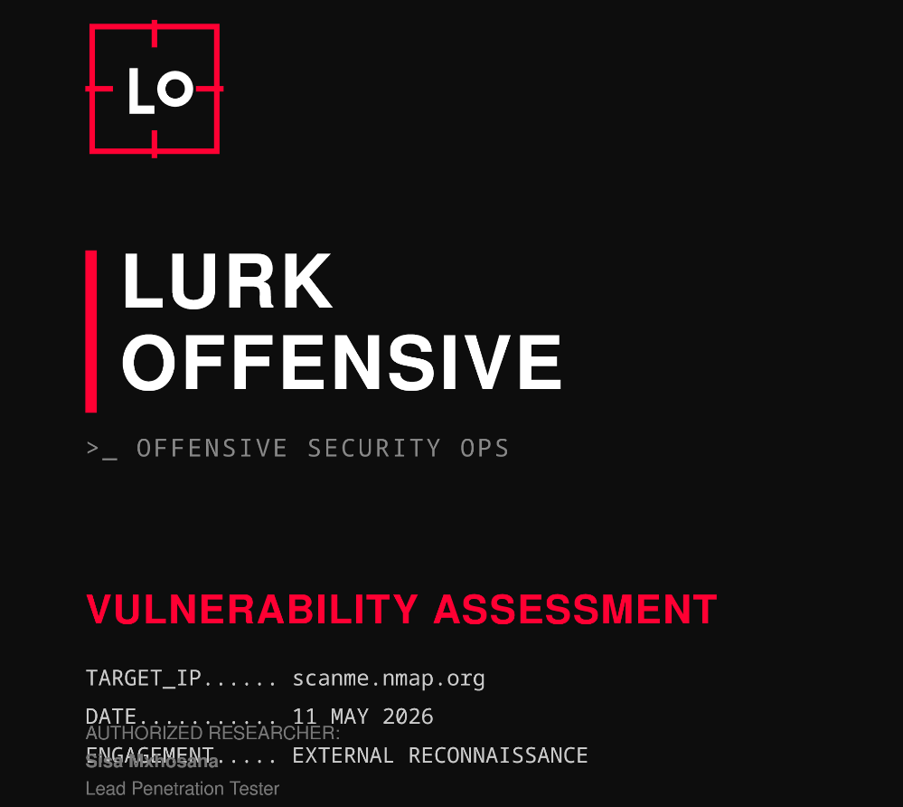

# Lurk Offensive Ops 
# Lurk Offensive: Vulnerability Assessments
**Lead Penetration Tester:** Sisa Mxhosana
# Objective: Documenting external reconnaissance and vulnerability assessments.
Latest Engagement: scanme.nmap.org (May 11, 2026).
**Scope:** External Reconnaissance

📄 **[Download/View the Full Vulnerability Report (PDF)](scanme-report.pdf)**
